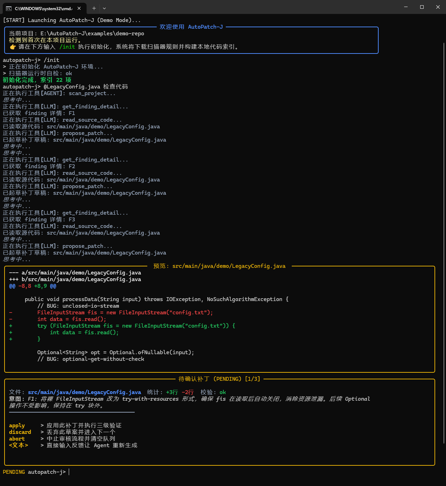

# AutoPatch-J

<p align="center">
  <strong>面向 Java 仓库的 AI 代码修复 Agent</strong><br/>
  用静态扫描建立证据，用 LLM 完成推理，用人工确认守住最后一道补丁边界。
</p>

<p align="center">
  
  
  
  
  
  
</p>

## 项目定位

AutoPatch-J 是一个面向 Java 仓库的命令行修复 Agent。它不是通用聊天机器人，也不是让大模型自由改代码的 AI Coding Bot。

它的核心目标是把代码检查、证据读取、补丁生成、补丁解释、补丁重写和人工确认放进一条可复核的工程链路里：

- 用户输入先进入意图识别，而不是直接交给 Agent 发散执行。
- 审计任务优先依赖静态扫描 finding 和源码证据。
- Agent 只能调用当前任务允许的 Function Call 工具。
- 补丁先进入待确认队列，由用户决定应用、丢弃、中止或要求重写。
- 普通问答可以有记忆，但不会污染代码审计和补丁修复。

## 运行效果



> 真实运行截图：AutoPatch-J 在审计 Java 文件后生成补丁草案，并进入人工确认队列。

## 能做什么

### 代码检查

```text
autopatch-j> @LegacyConfig.java 检查代码
autopatch-j> @src/main/java/demo 扫描这个目录
autopatch-j> 看一下这个项目里有没有空指针风险
```

- 优先执行本地静态扫描。
- finding 进入队列后逐项推进。
- Agent 基于 finding 和源码证据生成最小补丁。
- 候选补丁先由 Workflow 接收，再进入人工确认队列。

### 代码讲解

```text
autopatch-j> @LegacyConfig.java 这个文件是干嘛的
autopatch-j> @src/main/java/demo 解释一下这个目录
autopatch-j> 这个项目是干什么的
```

- 不触发审计扫描。
- 单文件解释默认不越界追踪。
- 项目级或目录级解释允许受控符号导航。
- 可读取普通问答 Memory，让跨轮项目讨论更连续。

### 补丁解释与重写

```text
autopatch-j> 为什么这么改？
autopatch-j> 这个补丁会影响性能吗？
autopatch-j> 改成 Objects.equals 的写法
autopatch-j> 加一行注释说明原因
```

- `patch_explain` 只解释当前待确认补丁。
- `patch_revise` 只重写当前待确认补丁。
- 如果用户只是问含义、原因、影响或风险，不会误调用修订工具。

### 工程相关聊天

```text
autopatch-j> Java Optional 怎么用？
autopatch-j> leetcode 第一题怎么解？
autopatch-j> 这个异常一般怎么排查？
```

`general_chat` 面向 Java、算法、调试、架构、工具使用和当前项目相关问题，不作为泛生活问答入口。

## 架构取舍

AutoPatch-J 的核心不是让 LLM 自由修改代码，而是把修复过程拆成三条受控链路：程序负责边界和状态，LLM 负责在证据范围内推理。

**受控的任务边界**：Workflow 负责意图、scope、扫描、finding 队列、补丁队列和人工确认；Agent 负责解释问题、读取证据、调用当前意图允许的工具，以及生成或重写补丁草案。每个 `IntentType` 都有独立工具白名单，聊天不会拿到补丁修改工具，补丁解释也不会变成补丁生成流程。原则：`Workflow owns state, Agent owns reasoning` / `Function Calls are gated by intent`

**证据优先的修复链路**：默认扫描器是 Semgrep，负责产出可定位的 finding；LLM 基于 finding、源码片段和当前 scope 做取证、解释和最小修复。补丁不是聊天回复，而是包含目标文件、关联 finding、unified diff、修复理由和校验状态的 review item，进入人工确认队列后由用户决定 `apply`、`discard` 或继续反馈。PMD、SpotBugs、Checkstyle 当前作为 planned scanner 展示。原则：`Scanner provides evidence, LLM performs triage` / `Patch is a review item, not a chat reply`

**隔离的上下文能力**：项目级 Memory 只服务 `code_explain` 和 `general_chat`，用于记住用户关注的项目事实和工程偏好，不进入 `code_audit`、`patch_explain`、`patch_revise`，避免历史偏好污染修复证据链。业务代码只声明 `LLMCallPurpose`，是否关闭 reasoning、是否流式输出、如何适配 DeepSeek、百炼、OpenAI 兼容接口，统一由 LLM 层处理。详细设计见 [Agent Memory 设计说明](docs/memory_design.md)。原则：`Memory helps chat, not repair` / `LLM calls are purpose driven`

## 五类任务边界

| IntentType | 场景 | 可用工具 | Memory | 关键边界 |
|---|---|---|---:|---|
| `code_audit` | 检查代码并生成补丁 | `get_finding_detail` / `read_source_code` / `propose_patch` | 否 | 以当前 scope、finding 和源码证据为准 |
| `code_explain` | 解释项目、目录、文件或代码 | `search_symbols` / `read_source_code` | 是 | 可继承用户对项目的关注点 |
| `general_chat` | Java、算法、调试、架构和工程常识问答 | 默认无 Function Call 工具 | 是 | 只回答工程相关问题 |
| `patch_explain` | 解释当前待确认补丁 | `search_symbols` / `read_source_code` | 否 | 只解释当前补丁，不生成新补丁 |
| `patch_revise` | 按反馈重写当前补丁 | `search_symbols` / `read_source_code` / `get_finding_detail` / `revise_patch` | 否 | 只替换当前补丁，不改后续队列 |

意图识别由短 LLM 完成，但程序会做硬约束。

例如没有待确认补丁时，即使分类器返回 `patch_explain` 或 `patch_revise`，
程序也会拒绝补丁态意图，避免输入被误路由到无法工作的流程。

## 系统如何运转

一次 `code_audit` 的主链路通常是：

```text
用户输入
-> UserIntentClassifier 判断 IntentType
-> ScopeResolver 解析 @mention 或当前项目范围
-> StaticScanRunner 执行 Semgrep 扫描
-> FindingBacklog 按 finding 逐项推进
-> Agent 在当前 TaskProfile 的工具白名单内执行 ReAct
-> Function Call 读取 finding 和源码
-> propose_patch 提交候选补丁草案
-> Workflow 判断本轮 finding 是否完成
-> ReviewWorkspaceManager 写入待确认补丁队列
-> 用户 apply / discard / abort / explain / revise
-> SearchReplacePatchEngine + PatchQualityVerifier 应用和复核
```

普通问答 Memory 的主链路是：

```text
code_explain/general_chat 完成
-> 写入 recent_turn，summary_status=pending
-> 满足触发条件后提交后台摘要任务
-> 短 LLM 输出 Memory Delta
-> 程序校验并写入 active_topics / long_term_memory
-> 下一轮普通问答只注入少量相关摘要
```

## 目录结构

```text
src/autopatch_j/
├─ cli/       # prompt-toolkit + Rich 交互层、命令路由、Workflow 编排、流式展示
├─ agent/     # ReAct 运行器、任务配置、工具执行、进度保护、消息适配
├─ llm/       # OpenAI 兼容客户端、调用意图策略、供应商流式方言
├─ tools/     # 暴露给 Agent 的 Function Call 工具和工具目录
├─ scanners/  # Semgrep 扫描器、planned scanner、扫描器目录
└─ core/      # 领域模型、意图、范围、扫描、补丁审核、补丁应用、Memory、项目索引

examples/demo-repo/   # 内置演示仓库
tests/                # 回归测试
docs/                 # 架构设计文档
```

## 代码阅读入口

建议按主流程阅读：

1. `src/autopatch_j/cli/app.py`：CLI 生命周期入口，负责启动、初始化 runtime 和主输入循环。
2. `src/autopatch_j/cli/input_router.py`：自然语言输入和补丁确认输入的路由层。
3. `src/autopatch_j/cli/workflows/`：CLI 侧业务流程编排，连接用户输入、扫描、Agent 和补丁确认。
4. `src/autopatch_j/agent/agent.py`：Agent 对外门面，聚合 session、task executor 和 Memory Summary Scheduler。
5. `src/autopatch_j/agent/react_runner.py`：ReAct 主循环，负责 LLM 调用、工具调用和进度保护。
6. `src/autopatch_j/core/user_input/`：意图识别、输入分类和 pending review 路由。
7. `src/autopatch_j/core/review/`：扫描结果、finding 队列、review workspace 和项目状态工件。
8. `src/autopatch_j/core/patching/`：search-replace 补丁应用和补丁质量复核。
9. `src/autopatch_j/core/memory/`：普通问答 Memory 的读写、摘要、注入和治理。

补充阅读：

- Function Call 工具：从 `src/autopatch_j/tools/function_calls/` 开始读。
- Memory 架构：直接看 [Agent Memory 设计说明](docs/memory_design.md)。

## 快速开始

### 环境要求

- Python `3.10+`
- OpenAI 兼容 LLM 接口

安装依赖：

```bash
pip install -e .[test]
```

### 环境变量

AutoPatch-J 读取系统环境变量，不会自动加载 `.env` 文件。

最少需要配置：

```bat
set AUTOPATCH_LLM_API_KEY=your_api_key
```

常用配置：

```bat
set AUTOPATCH_LLM_BASE_URL=https://api.deepseek.com
set AUTOPATCH_LLM_MODEL=deepseek-v4-flash
set AUTOPATCH_DEBUG=true
set AUTOPATCH_LLM_STREAM_DIALECT=standard
```

说明：

| 环境变量 | 默认值 | 说明 |
|---|---|---|
| `AUTOPATCH_LLM_API_KEY` | 空 | 关键配置。缺失时无法创建可用 LLM 客户端 |
| `AUTOPATCH_LLM_BASE_URL` | `https://api.deepseek.com` | OpenAI 兼容接口地址 |
| `AUTOPATCH_LLM_MODEL` | `deepseek-v4-flash` | 国产 V4 模型已足够兼顾准确率和速度；也可替换为供应商支持的其他 OpenAI 兼容模型名 |
| `AUTOPATCH_DEBUG` | `false` | 仅设置为 `true` 时展示完整思考链和工具输出详情 |
| `AUTOPATCH_LLM_STREAM_DIALECT` | `standard` | 可选 `standard`、`bailian-dsml` |
| `AUTOPATCH_LLM_REASONING_EFFORT` | 空 | 透传给支持该参数的供应商 |
| `AUTOPATCH_LLM_EXTRA_BODY` | `{}` | 供应商私有扩展参数，必须是 JSON object 字符串 |

### 启动

Windows 测试入口：

```bat
run_on_windows.bat
```

脚本会检查 Python 环境、创建 `.venv`、同步依赖，并默认进入内置演示工程：

```text
examples/demo-repo
```

手动启动：

```bash
python -m autopatch_j
```

### 常用命令

```text
/init       初始化当前目录为 Java 项目并建立索引
/status     查看当前项目状态、LLM 模型、调试模式、补丁缓冲区和符号索引
/scanner    查看扫描器状态、版本和说明
/reindex    重建本地代码符号索引
/reset      清空工作台状态、Agent 对话历史和普通问答记忆
/help       显示命令帮助
/quit       退出程序
```

补丁待确认阶段可直接输入：

```text
apply       应用当前补丁
discard     丢弃当前补丁
abort       中止审核并丢弃剩余补丁
```
